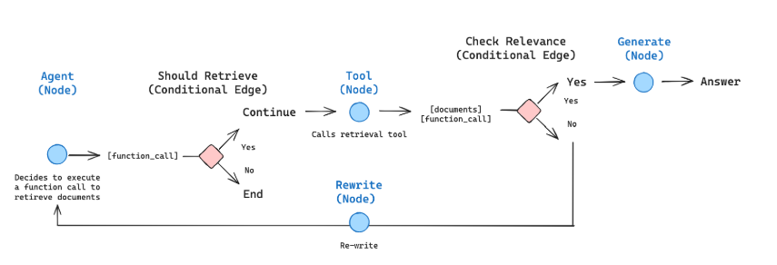
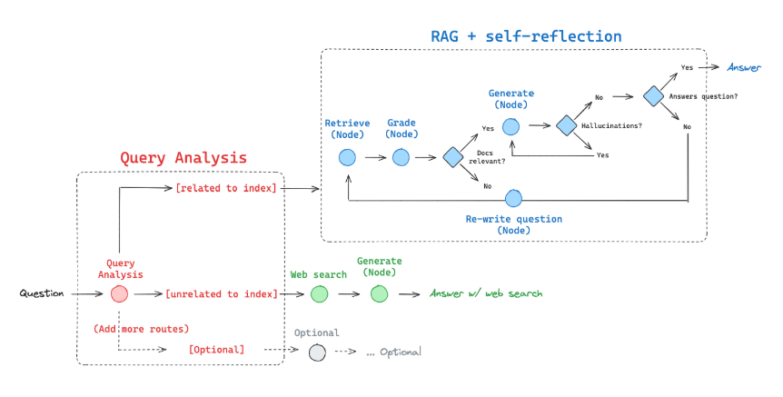

# Corrective RAG

Corrective-RAG (CRAG) is a strategy for Retrieval-Augmented Generation (RAG) 
that incorporates self-reflection and self-grading on retrieved documents. 
This approach aims to enhance the relevance and accuracy of generated responses 
by evaluating and refining the information used during the generation process.

## Key Concepts

In the paper [here](https://arxiv.org/pdf/2401.15884), several steps are outlined for implementing 
Corrective-RAG:

1. **Relevance Threshold**:
   - If at least one document exceeds the threshold for relevance, the process 
   proceeds to generation.
   - Before generation, it performs knowledge refinement by partitioning the 
   document into "knowledge strips."
   - Each strip is graded, and irrelevant ones are filtered out.

2. **Supplemental Retrieval**:
   - If all documents fall below the relevance threshold or if the grader is 
   unsure, the framework seeks an additional data source.
   - Web search is used to supplement retrieval, ensuring that the most 
   relevant information is available for generation.

## Implementation with LangGraph

We will implement some of these ideas from scratch using [LangGraph](https://langchain-ai.github.io/langgraph/), focusing 
on the following aspects:

- **Skipping Knowledge Refinement**:
  - As a first pass, we will skip the knowledge refinement phase. This can be 
  added back as a node if desired.

- **Supplemental Retrieval with Web Search**:
  - If all documents are irrelevant, we will opt to supplement retrieval with 
  web search.
  - [Tavily Search](https://python.langchain.com/v0.2/docs/integrations/tools/tavily_search/) will be used for web search, providing a robust mechanism 
  for finding additional relevant information.

- **Query Re-Writing**:
  - We will use query re-writing to optimize the query for web search, 
  enhancing the quality and relevance of the retrieved documents.

## Future Enhancements

- **Knowledge Refinement**:
  - Implementing the knowledge refinement phase as a separate node in the 
  LangGraph workflow can further enhance the accuracy of the generated responses.

- **Dynamic Thresholds**:
  - Exploring dynamic thresholds for relevance can provide more flexibility 
  and adaptability in different contexts.

By leveraging these strategies, Corrective-RAG aims to improve the quality of 
RAG systems, making them more reliable and effective in generating accurate 

# Agentic RAG

[Retrieval Agents](https://python.langchain.com/v0.2/docs/tutorials/qa_chat_history/#agents) are powerful tools designed to make informed decisions about 
whether to retrieve data from an index. By leveraging the capabilities of a 
Language Model (LLM) and a retriever tool, these agents can efficiently access 
and utilize relevant information.

# Self-RAG

Self-RAG is an advanced strategy for Retrieval-Augmented Generation (RAG) that 
incorporates self-reflection and self-grading on both retrieved documents and 
generated responses. This approach aims to enhance the accuracy and relevance 
of the information used and produced by the system.

# Adaptive RAG

Adaptive RAG is an innovative strategy for Retrieval-Augmented Generation (RAG) that combines query analysis with active and self-corrective RAG techniques. This approach aims to optimize the retrieval and generation process by dynamically adapting to the nature of the query.

## Overview

In the foundational paper, Adaptive RAG is described as a method that routes queries through different retrieval strategies based on query analysis. The strategies include:

1. **No Retrieval**: For queries that can be answered without additional information.
2. **Single-shot RAG**: For straightforward queries requiring minimal retrieval.
3. **Iterative RAG**: For complex queries that benefit from multiple rounds of retrieval and refinement.

## Implementation with LangGraph

Building on these concepts, we will implement an Adaptive RAG system using LangGraph, focusing on the following routing strategies:

- **Web Search**: Utilized for questions related to recent events or topics not covered in the existing index. This ensures access to the most current information.
- **Self-corrective RAG**: Applied to questions related to our index, allowing for iterative refinement and self-correction to improve the accuracy and relevance of the generated responses.

### Steps to Implement Adaptive RAG

1. **Query Analysis**:
   - Analyze the query to determine its nature and requirements.
   - Decide the appropriate retrieval strategy based on the analysis.

2. **Routing Logic**:
   - Implement logic to route the query to either web search or self-corrective RAG based on the analysis.
   - Ensure seamless integration and transition between different strategies.

3. **Integration with LangGraph**:
   - Use LangGraph to structure the workflow, manage state, and facilitate decision-making processes.
   - Define nodes and edges to represent different retrieval strategies and transitions.

